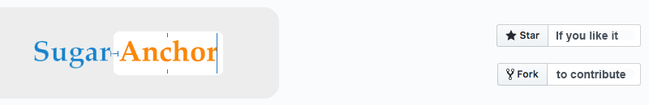

# 

[](https://travis-ci.org/ashikahmad/SugarAnchor)
[](http://cocoapods.org/pods/SugarAnchor)
[](http://cocoapods.org/pods/SugarAnchor)
[](http://cocoapods.org/pods/SugarAnchor)

SugarAnchor is syntactic sugar on `NSLayoutAnchor` to help us write more compact, readable and easy layout code. It wraps up all of `NSLayoutXAxisAnchor`, `NSLayoutYAxisAnchor` and `NSLayoutDimension` functionalities under some easy to use operators to reduce verbosity.

## Features

- Simple, concise, native<sup>[1]</sup>. Almost zero learning curve
- Typesafe, similar to NSLayoutAnchor
- Unit tested
- Small codebase (less than 300 LOC)

> [1] Same NSLayoutAnchor/NSLayoutConstraints, just syntactic sugar on it

## Example

To run the example project, clone the repo, and run `pod install` from the Example directory first.

## Requirements

- [x] Xcode 8.3 or above
- [x] Swift 3.1
- [x] iOS 9.0 or above

## Installation

SugarAnchor is available through [CocoaPods](http://cocoapods.org). To install
it, simply add the following line to your Podfile:

```ruby
pod "SugarAnchor"
```

## Operator Summary

Let's looks at a simple NSLayoutAnchor code:
```swift
(redView.leadingAnchor.constraint(equalTo: view.leadingAnchor, constant: 20)).isActive = true
```

With SugarAnchor, it become:
```swift
redView.leadingAnchor =*= view.leadingAnchor + 20
```

Think `*` as **Active constraint** and `~` as **Inactive constraint**. Then with `=*=`, you'll create an active constraint directly or with `=~=` you may create an inactive constraint which you can activate later.

```swift
view1.leftAnchor =*= view2.leftAnchor + 10

// Or

let leftConstraint = (view1.leftAnchor =~= view2.leftAnchor + 10)
leftConstraint.isActive = true
```
In each case, you'll get the constraint to keep or just ignore. For example, for an active one:
```swift
self.heightConstraint = (v1.heightAnchor =*= 200)
// Later somewhere
self.heightConstraint.constant = 100
```
## Operator list


Operator | Description | Example
--- | --- | ---
<kbd>=*=<\kbd> | Equal<br>(Active) | ❖ `v1.leadingAnchor =*= v2.leadingAnchor`<br>❖ `v1.leftAnchor =*= v2.leftAnchor + 20`<br>❖ `v1.widthAnchor =*= v2.widthAnchor / 2 + 10`<br>❖ `v1.heightAnchor =*= 200`
<kbd><*=<\kbd> | LessThanOrEqual<br>(Active) | ❖ `v1.bottomAnchor <*= container.bottomAnchor - 8`
<kbd>>*=<\kbd> | GreaterThanOrEqual<br>(Active) | ❖ `v2.leadingAnchor >*= v1.trailingAnchor + 5`
<kbd>=~=<\kbd> | Equal<br>(Inactive) | ❖ `(v1.widthAnchor =~= 200).isActive = true`
<kbd><~=<\kbd> | LessThanOrEqual<br>(Inactive) | ❖ `(v1.bottomAnchor <~= container.bottomAnchor - 8).isActive = true`
<kbd>>~=<\kbd> | GreaterThanOrEqual<br>(Inactive) | ❖ `(v2.leadingAnchor >~= v1.trailingAnchor + 5).isActive = true`


## Author

ashikahmad, ashikcu@gmail.com

## License

SugarAnchor is available under the MIT license. See the LICENSE file for more info.
